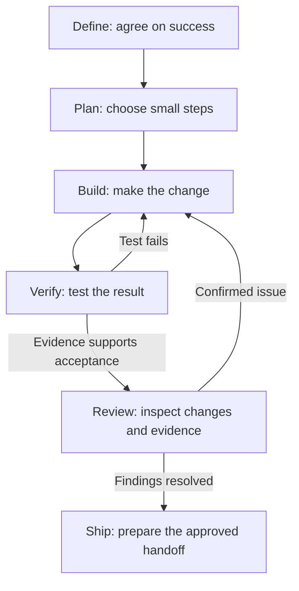

# AI Workflow

**Practical prompts, templates, and checks for planning, testing, and reviewing
work with AI coding agents.**

Start with a clear definition of success, make small changes, test the result,
and review before shipping. Use the Markdown instructions with your coding
agent; add the optional scripts and tool adapters when you need them.

Start here: [Codex](codex/) · [Claude Code](#tool-adapters).
Both use the shared workflow, prompts, and templates in this repository.

> **AI is a capable coworker who overstates its progress. Ask for evidence.**

This started with more than 20,000 lines of AI-assisted code and one missing
critical path: the Kafka integration the AI had already called "done."

The files were there. The code looked clean. The system still did not work.

So I stopped treating AI development as a better prompt and started treating
it as a system:

`messy request → explicit contract → isolated work → evidence → independent review → durable handoff`

This repository contains the portable Markdown contracts, prompts, templates,
and checks behind that system. Any coding agent can use the canonical files;
tool-specific configuration is optional glue.

## Quick start

Clone the workflow, configure your project's instructions, then start a task.
This setup does not install Git hooks or CI in your project.

You need Git and a coding agent for the steps below. Optional Python checks need
Python 3.10 or newer; the PowerShell helpers need PowerShell 7 (`pwsh`). Installing
the hook template also needs `pre-commit`. These tools are not bundled with the repo.

1. Clone the shared workflow.

   ```bash
   git clone https://github.com/quietbranch88/ai-workflow.git ~/.ai-workflow
   ```

2. Change into **your target project's root directory**, then add the
   project-instruction template without overwriting local rules.

   If `AGENTS.md` already exists, merge the relevant sections from
   [`templates/AGENTS.md.template`](templates/AGENTS.md.template) into it. If it
   does not exist, use the guarded copy command for your shell:

   ```bash
   # macOS / Linux
   test -e ./AGENTS.md && echo "AGENTS.md exists; merge it manually" || \
     cp ~/.ai-workflow/templates/AGENTS.md.template ./AGENTS.md
   ```

   ```powershell
   # PowerShell
   if (Test-Path ./AGENTS.md) {
     Write-Host "AGENTS.md exists; merge it manually"
   } else {
     Copy-Item "$HOME/.ai-workflow/templates/AGENTS.md.template" ./AGENTS.md
   }
   ```

3. Configure the copied or merged `AGENTS.md` before using it:

   - Choose one project type: `personal` or `team`.
   - Declare whether task records are tracked or
     [local-only](docs/local-spec-policy.md). Keep private records out of Git.
   - Fill in the project context and actual lint/test commands. Remove unused
     placeholders; state when a check is unavailable instead of inventing one.

4. Give your coding agent one instruction:

```text
Read AGENTS.md and ~/.ai-workflow/workflow.md, then follow the six-stage
workflow for this task. Do not claim completion without verification evidence.
```

Optional shell helpers live in [`shell/aliases.sh`](shell/aliases.sh).

<details>
<summary>Optional task bootstrap</summary>

For a guided intake that can create ticket files and an isolated workspace:

```powershell
# Run inside the target repository:
pwsh ~/.ai-workflow/scripts/start-task.ps1

# Or name the repository explicitly:
pwsh ~/.ai-workflow/scripts/start-task.ps1 -RepoPath C:\path\to\repo
```

The default prints a kickoff prompt you can paste into Codex or another agent.
The optional `-LaunchCodex` switch additionally needs the Codex CLI and your own
named profiles (`plan`, `build`, `test`, `review`, `ship`); this repo does not
install those profiles. Use the default when they are not configured.

</details>

<details>
<summary>Optional checks and this repository's CI</summary>

The [pre-push template](templates/pre-commit.template.yaml), when installed,
uses **WIP mode**: draft checkboxes may remain open, but ticket documents must
be structurally valid. It is a local safeguard, not server-side enforcement.

**This repository's** [GitHub workflow](.github/workflows/validate.yml) runs
tests, both strict Claude adapter validators, and **Ship mode**. Under the
tracked policy, every change outside the living documents requires completed
ticket records, plus `devlog.md` and `todo.md` for personal projects. This
includes small Markdown corrections: the validator checks paths, not the size
or meaning of a change. Keep the required records brief and factual.

CI explicitly passes `--project-type personal`, so changing the project-type
marker in `AGENTS.md` alone does not change that check. This does not prevent
a PR from changing the workflow or validator; those changes still need review.
Other projects must configure their own checks; cloning this repo installs none.

These checks validate record structure, not whether a claim is true. Acceptance
wording without an observable result, environment, or verification step produces
a warning. Projects with private records can select
[local-only validation](docs/local-spec-policy.md); do not upload private
records to satisfy this repository's tracked-record convention.

</details>

## The operating loop



The loop is Define → Plan → Build → Verify → Review → Ship, with failed tests
and confirmed findings returning to Build. Missing required evidence leaves the
task unverified. Ship does not grant permission to merge or deploy.

| Stage | The question | Evidence it leaves behind |
|---|---|---|
| **Define** | What are we actually solving? | scope, constraints, acceptance criteria |
| **Plan** | What are the smallest verifiable steps? | atomic task list |
| **Build** | Can the change be made safely and in scope? | focused diff on an isolated branch or worktree |
| **Verify** | Does it work in the environment tested? | commands, tests, output, file references |
| **Review** | Is it right, safe, and maintainable? | independent findings and decisions |
| **Ship** | Can the next person recover the truth? | commit, PR, updated handoff docs |

Two distinctions carry most of the weight:

- **A claim is not evidence.** "Done" means the acceptance criteria have proof.
- **Verify is not Review.** Tests ask whether it works; review asks whether it
  is the right, safe, maintainable thing.

The complete process lives in [`workflow.md`](workflow.md).

Scale the work to the change: review a wording correction and check its links;
give a behavior change explicit acceptance criteria and targeted tests; exercise
the affected real services for a cross-service change. Keep task records brief,
and follow any configured Ship checks described above. TDD and parallel agents
are optional unless your project requires them.

## Choose the model; keep the gates

There is no separate smart-model and cheap-model workflow. Every model keeps
the same acceptance criteria, verification, review, and evidence gates.

- **Fast / low-cost** — search, classification, formatting, and deterministic
  checks. Give exact files, narrow output, and read-only access by default.
- **General coding** — the default for accepted, well-bounded implementation
  and review work. Give one slice, one allowed change surface, and exact checks.
- **Strongest reasoning** — escalate for ambiguity, architecture, conflicting
  evidence, high-risk changes, or repeated failure on the same bounded task.

Use a weaker model by shrinking the task and making the contract explicit, not
by lowering the definition of done. See the full routing policy in
[`workflow.md`](workflow.md#model-routing-one-workflow-different-autonomy).

## Find what you need

- **Understand the principles** — [`PHILOSOPHY.md`](PHILOSOPHY.md)
- **Run Define → Ship** — [`workflow.md`](workflow.md)
- **Recognize recurring failure patterns** — [`GOTCHAS.md`](GOTCHAS.md)
- **Decode workflow terminology** — [`GLOSSARY.md`](GLOSSARY.md)
- **Manage ticket and cross-project context** — [`context-management.md`](context-management.md)
- **Clarify a vague request** — [`prompts/grill-me.md`](prompts/grill-me.md)
- **Prove completion** — [`prompts/verify-done.md`](prompts/verify-done.md)
- **Review adversarially** — [`prompts/review-checklist.md`](prompts/review-checklist.md)
- **Avoid technical traps** — [`pitfalls/`](pitfalls)

<details>
<summary>Repository map</summary>

- [`prompts/`](prompts) — reusable clarification, debugging, review, audit, and
  verification actions.
- [`pitfalls/`](pitfalls) — pre-write checklists for mistakes agents repeat.
- [`templates/`](templates) — project rules, specs, tasks, ADRs, maps, and hooks.
- [`scripts/`](scripts) — task bootstrap, map validation, and WIP/Ship close-loop guards.
- [`codex/`](codex) — Codex setup guide using the shared Markdown instructions.
- [`claude-code/plugin/`](claude-code/plugin) — optional Claude Code adapter.

Canonical documents stay tool-agnostic. Adapter copies that declare a
`Canonical source` must be updated with their source so drift stays visible.

</details>

The detailed [verification contracts](docs/verification.md) require independent
test oracles, applicable defect-detection evidence and real integration/E2E boundaries.
TDD is optional unless required. [Review modes and decisions](docs/review.md) distinguish
initial reviews, focused follow-ups and claim checks, preserving evidence and counterevidence.

## Tool adapters

The tool folders are entry points to the same workflow: [Codex setup](codex/)
uses project instructions; `claude-code/` also provides a packaged Claude plugin.
Shared rules live in `workflow.md`, `prompts/`, `docs/`, and `templates/`.

**Codex** reads project `AGENTS.md` files directly. Other coding agents should
use their project-instruction mechanism to read the same file. If a tool cannot
import it, keep a thin shim that points to `AGENTS.md`; do not duplicate rules.

For Codex, use the same clone and template setup above, then open **your target
project** in Codex and send the Quick start instruction. The shared clone supplies
the referenced workflow files; cloning it alone does not configure other projects.
The Claude marketplace commands below are only for the optional Claude adapter.

Parallel agents and automatic model routing are optional optimizations, not
prerequisites for the six-stage workflow.

<details>
<summary>Claude Code plugin (optional)</summary>

Use [`templates/CLAUDE.md.template`](templates/CLAUDE.md.template) as a thin
shim that imports `AGENTS.md`, or install the packaged skills and agents:

```text
/plugin marketplace add quietbranch88/ai-workflow
/plugin install ai-workflow@quietbranch88
```

For global rules, start from
[`claude-code/CLAUDE.md.example`](claude-code/CLAUDE.md.example).

</details>

## Keep lessons durable

Every reusable lesson should have one home:

- reusable prompt pattern → `prompts/`
- language or library trap → `pitfalls/<language>.md`
- repo-specific rule → that repository's `AGENTS.md`
- ticket-specific workaround → `.spec/<ticket>/ai-development-map.md`
- process change → `workflow.md`
- principle change → `PHILOSOPHY.md` — rarely

This is how the workflow improves: turn real failures into rules at the correct
boundary instead of collecting more instructions everywhere.

## The longer story

- [AI Is a Coworker Who Overstates Its Progress: How I Build With It](https://zoe-builds.com/en/articles/my-ai-workflow/)
  — the missing Kafka
  integration that led to this workflow and its acceptance criteria.
- [AI Found the Kafka Bugs. Which Decisions Are Still Mine?](https://zoe-builds.com/en/articles/kafka-ai-human-decisions/)
  — a later example of deciding acceptable outcomes before implementing retries
  and recovery. The article distinguishes investigation from deployed fixes.

More writing at [Zoe Builds](https://zoe-builds.com/).
