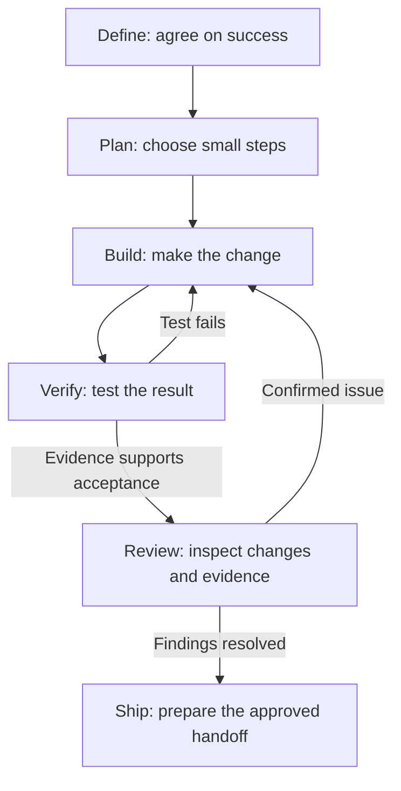

# AI Workflow

**Prompts, templates, and checks that help coding agents plan changes, test results,
and show evidence before calling work done.**

Use the shared Markdown files with [Codex](codex/) or [Claude Code](#tool-adapters).
Scripts and plugins are optional.

## Quick start

You need Git, a coding agent, and a project to work on. Cloning this repository
does not install hooks or CI in your project.

### 1. Download the shared workflow

```bash
git clone https://github.com/quietbranch88/ai-workflow.git ~/.ai-workflow
```

### 2. Configure your project

Open **your target project's root directory**. Copy
[`templates/AGENTS.md.template`](templates/AGENTS.md.template) to `AGENTS.md` there.
If `AGENTS.md` already exists, merge the relevant sections and preserve existing rules.

Before using it, choose `personal` or `team`, fill in the project context and
real lint/test commands, and remove unused placeholders. State when a check is
unavailable. Choose whether task notes belong in Git (`tracked`) or must stay
private ([`local-only`](docs/local-spec-policy.md)).

<details>
<summary>Copy commands for macOS / Linux and PowerShell</summary>

Run from your target project. These commands preserve an existing `AGENTS.md`.

```bash
# macOS / Linux
test -e ./AGENTS.md && echo "AGENTS.md exists; merge it manually" || \
  cp ~/.ai-workflow/templates/AGENTS.md.template ./AGENTS.md
```

```powershell
# PowerShell
if (Test-Path ./AGENTS.md) {
  Write-Host "AGENTS.md exists; merge it manually"
} else {
  Copy-Item "$HOME/.ai-workflow/templates/AGENTS.md.template" ./AGENTS.md
}
```

</details>

### 3. Start a task

Open the target project in your coding agent and start a new session. Send this
instruction followed by the task you want done:

```text
Read AGENTS.md and ~/.ai-workflow/workflow.md, then follow the six-stage
workflow for this task. Do not claim completion without verification evidence.

Task: [describe the change and what a successful result looks like]
```

Use your actual clone path if it differs. The shared files must be accessible
where the agent runs; a local clone is not automatically available in the cloud.
For Claude Code, add the [thin CLAUDE.md shim](templates/CLAUDE.md.template)
that imports `AGENTS.md`, preserving any existing instructions.

For example, in a project with a CSV export, a first task could be:

```text
Task: Fix CSV export when a field contains a comma.
Success: Exporting the name "Doe, Jane" produces one name field, not two columns.
Check: Use synthetic data in the local test environment. Parse the exported CSV
with a CSV reader and assert the original field values and column count.
Show the failing case before the fix, then the passing result. If you cannot
run the check, report the blocker and leave that result unverified.
```

Expect a focused change, test commands and results, review findings, and any
remaining gaps. You still authorize merges and deployments separately.

## The operating loop



| Stage | What to leave behind |
|---|---|
| **Define** | The problem, scope, and observable success criteria |
| **Plan** | Small steps with a way to check each one |
| **Build** | A focused change on an isolated branch or worktree |
| **Verify** | Test commands, results, and unverified gaps |
| **Review** | Independent findings and how they were resolved |
| **Ship** | The change and evidence prepared for an authorized handoff |

Failed tests and confirmed findings return to Build. Missing required evidence
leaves the task unverified. Ship does not grant permission to merge or deploy.

Scale checks to the change: review text and links for a wording correction;
use targeted tests for a behavior change; exercise affected real services for
a cross-service change. TDD and parallel agents are optional unless your project
requires them. See [`workflow.md`](workflow.md) for the full process.

## Optional setup

<details>
<summary>Optional task bootstrap</summary>

The guided intake can create task records and an isolated workspace. It needs
PowerShell 7 (`pwsh`). Run inside the target repository:

```powershell
pwsh ~/.ai-workflow/scripts/start-task.ps1
```

The default prints a kickoff prompt to paste into your agent. `-LaunchCodex`
also needs the Codex CLI and your own named profiles (`plan`, `build`, `test`,
`review`, `ship`); this repo does not install them. Use the default if they are
not configured. Optional shell helpers: [`shell/aliases.sh`](shell/aliases.sh).

</details>

<details>
<summary>Optional checks and this repository's CI</summary>

Python checks need Python 3.10 or newer. Installing the
[pre-push template](templates/pre-commit.template.yaml) also needs `pre-commit`.
These tools are not bundled. The installed hook uses **WIP mode**: draft task
checkboxes may remain open, but records must be structurally valid. This is a
local safeguard, not server-side enforcement.

**This repository's** [GitHub workflow](.github/workflows/validate.yml) runs tests,
both strict Claude adapter validators, and **Ship mode**. Under the tracked
policy, every change outside the living documents requires completed task
records, plus `devlog.md` and `todo.md` for personal projects. This includes small
Markdown corrections: the validator checks paths, not change size or meaning.
Keep records brief and factual.

CI pins `--project-type personal`, so editing the AGENTS marker alone does not
change that check. Workflow and validator changes still need review. Other
projects must configure their own checks; cloning this repo installs none.

These checks validate record structure, not whether claims are true. Acceptance
wording missing an observable result, environment, or verification step produces
a warning. Use [local-only validation](docs/local-spec-policy.md) for private
records; do not upload them to satisfy a tracked-record convention.

</details>

<details>
<summary>Model choice and parallel agents</summary>

Start with a general coding model for a bounded task. Use faster models for
search and deterministic checks; escalate ambiguous, high-risk or repeatedly
failing tasks to stronger reasoning. Every model keeps the same acceptance and
evidence gates. See [model routing](workflow.md#model-routing-one-workflow-different-autonomy).
Parallel agents are optional; they do not replace verification.

</details>

## Tool adapters

Both tools use the same shared workflow. [Codex setup](codex/) explains project
instruction discovery and file access. Other agents can use their own instruction
mechanism to read `AGENTS.md`; keep adapters thin instead of copying the rules.

<details>
<summary>Claude Code plugin (optional)</summary>

For packaged Claude skills and agents:

```text
/plugin marketplace add quietbranch88/ai-workflow
/plugin install ai-workflow@quietbranch88
```

For global instructions, see [`claude-code/CLAUDE.md.example`](claude-code/CLAUDE.md.example).
Codex uses the shared Markdown files without this plugin.

</details>

## Find what you need

- **Principles and common mistakes:** [`PHILOSOPHY.md`](PHILOSOPHY.md), [`GOTCHAS.md`](GOTCHAS.md), [`GLOSSARY.md`](GLOSSARY.md)
- **Task prompts:** [clarify a request](prompts/grill-me.md), [verify completion](prompts/verify-done.md), [review changes](prompts/review-checklist.md)
- **Detailed contracts:** [verification](docs/verification.md), [review](docs/review.md), [cross-project context](context-management.md)
- **Reusable project files:** [`templates/`](templates), [`scripts/`](scripts), [`pitfalls/`](pitfalls)

## The longer story

> **AI is a capable coworker who overstates its progress. Ask for evidence.**

This workflow grew out of an AI-assisted project whose Kafka integration was
missing even after the AI called it done. The background and later lessons:

- [AI Is a Coworker Who Overstates Its Progress: How I Build With It](https://zoe-builds.com/en/articles/my-ai-workflow/)
  — the missing integration that led to this workflow.
- [AI Found the Kafka Bugs. Which Decisions Are Still Mine?](https://zoe-builds.com/en/articles/kafka-ai-human-decisions/)
  — deciding acceptable outcomes before implementing retries and recovery;
  investigation and deployed fixes are distinguished.

More writing at [Zoe Builds](https://zoe-builds.com/).
